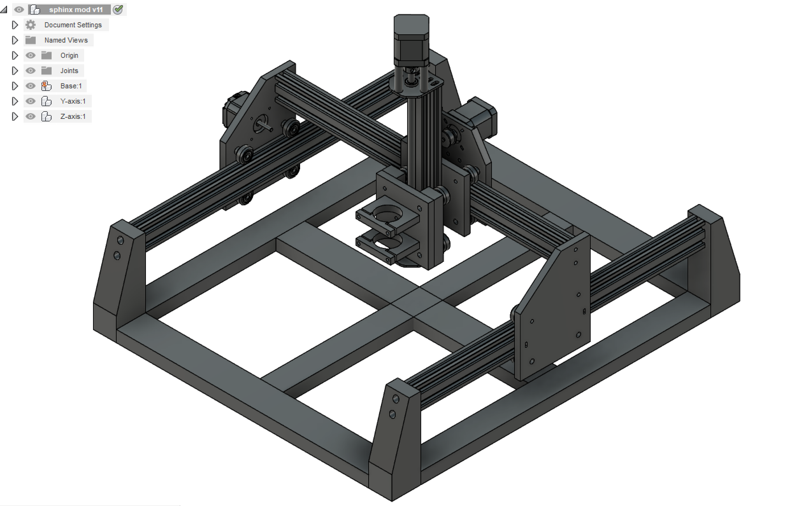

# CNC Machine

The original plan was to build a robot arm, but for that I needed a 3D printer, and to build that I needed a CNC machine (if i didn't buy one already made). So that's how this project got started. Being at college all year, it took me about a year to complete this project. 

So what is it? A CNC machine is basically a spindle that has a bit attached to it that has the ability to move in 3 or more directions.

How does it work? Software takes a digital 2D or 3D drawing and draws a toolpath, according to tool specifications and clearances. Software makes g-code out of the toolpath, and this g-code is sent to the CNC machine. The machine then follows this g-code to carve/remove material from the stock.

In the following sections we'll look at:
- My Design;
- Validation and Adjustments; and
- Future Developments.

## My Design

The build is mostly based on the Openbuilds Sphinx 55, but I designed the base, frame, and axis parts in Fusion360. The motor is a direct drive 500W 100V DC motor. I opted for this because I didn't really want a loud Dewalt router. The X-axis has one Nema17 stepper rated at 84oz.in, and the Y-axis also has one of those. Both the X and Y are belt-driven. The Z-axis was originally my own design using a 20x40mm aluminum extrusion, a lead screw and a Nema17 stepper. I have 3 limit switches, one on each axis.

This design is to used in carving wood, soft plastics, and soft aluminum (though the latter is still to be confirmed).

The base is all made of wood with a work area of 370x345x55mm. All the rails are 20x40mm aluminum extrusions. The original controller I used was the MKS BaseL V2.1. More on this in the next section.

### Parts list
- 3x GT2 20 teeth pulley
- T8 300mm Lead Screw
- 250mm V-Slot Aluminum Extrusion
- 3x 500mm V-Slot Aluminum Extrusion
- GT2 Timing Belt
- 16x POM V-Slot wheels with bearings
- 10x M5 T Sliding Nut
- Flexible Coupling shaft (5mm x 8mm)
- ER11 1-7mm Chuck
- 10x20mm Plastic Cable Drag
- 500W Spindle Motor (ER11 Chuck) (https://www.banggood.com/Machifit-ER11-Chuck-CNC-500W-Spindle-Motor-with-52mm-Clamps-and-Power-Supply-Speed-Governor-p-1027937.html?rmmds=myorder&cur_warehouse=USA)
- Eccentric Spacers
- M5 5mm Spacers
- 24V PSU
- MKS BaseL V2.1
- Wire
- 3x Nema17 Stepper Motors

Total cost: Around 400$ CAD

### Software
- Fusion 360:
  - General Design of the CNC machine
  - 2D and 3D designs to be milled
  - Toolpaths and g-code generation
- Openbuilds Control
  - g-code execution
  - position and homing control
  
## Validation and Adjustments
  
After first turning it on and trying to move the thing, I popped two of the stepper drivers on the controller board because of faulty wiring. In addition, the Nema17 stepper for the Z-axis wasn't strong enough to lift the spindle motor. Therefore, I bought the C-beam linear actuator from Openbuilds with a lead screw and Nema23 stepper to replace the Z-axis actuator I had designed. I also ordered the Openbuilds Blackbox motion controller to replace the one I burnt. Both of these together set me back another 450$ CAD, bringing the total up to around 850$. However, the Blackbox does have a nice GUI that comes along with it: Openbuilds Control. This makes it easy to control the CNC machine and the home the machine when needed. 

After assembling everything and making a few test pieces, I found out that the single motor on the X-axis was not enough. The side without the motor would often lag behind the other side when changing directions and would therefore create uneven cuts, making what was supposed to be circles look like ellipses. To fix this, I decided to add a stabilizer beam across the x-axis. This improved the results a little bit but it wasn't enough.

So finally, I used the left-over Nema17 stepper from the previous Z-axis design and added it to the X-axis. This solved all my problems in the X-axis, and the Blackbox has a fourth stepper driver that can be "slaved off" to any of the other axes. 

Finally, I made a nicer "stabilizer" arm using the CNC machine, but now it's mostly just for cosmetics.

## Future Developments

- Add another limit switch to each axis for the opposite bound
- Find a better way to hold stock down
- Use larger/longer aluminum extrusions to increase work area
- Add an RPM monitor to the spindle (potentially control via software)
