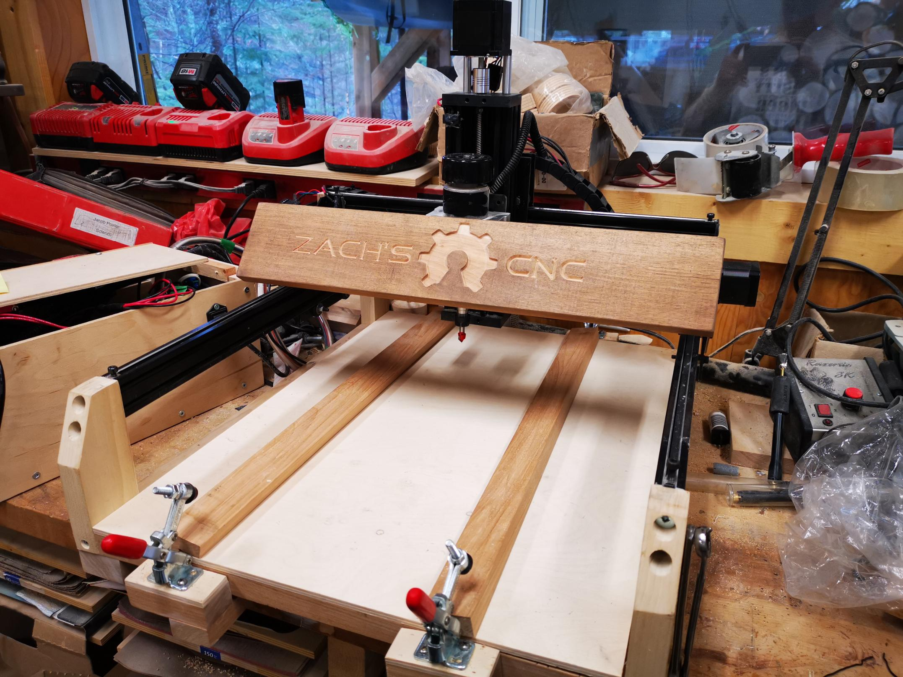

# CNC Machine

The original plan was to build a robot arm, but for that I needed a 3D printer, and to build that I needed a CNC machine (if i didn't buy one already made). So that's how this project got started. Being at college all year, it took me about a year to complete this project. 

So what is it? A CNC machine is basically a spindle that has a bit attached to it that has the ability to move in 3 or more directions.

How does it work? Software takes a digital 2D or 3D drawing and draws a toolpath, according to tool specifications and clearances. Software makes g-code out of the toolpath, and this g-code is sent to the CNC machine. The machine then follows this g-code to carve/remove material from the stock.

In the following sections we'll look at:
- My Design;
- Validation and Adjustments; and
- Future Developments.

