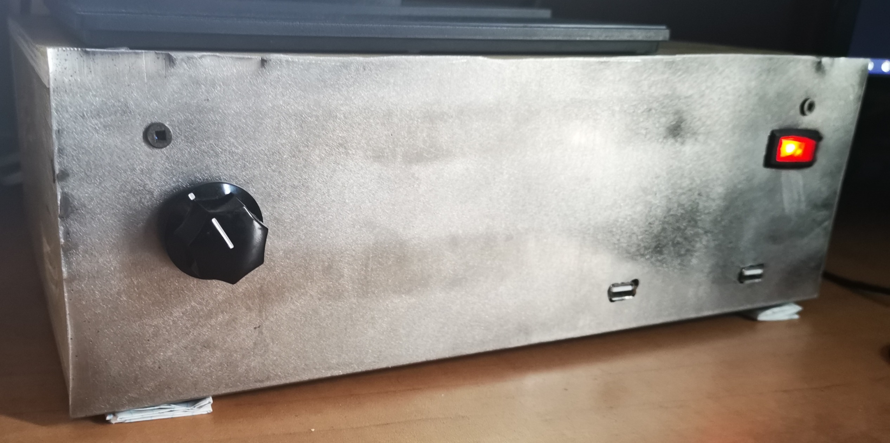

# freeDSP Classic SMD B
I needed a crossover for my speakers. Now if you try googling "3-way stereo crossover" you won't find much under 200$CAD that has good reviews. 

I did find some good 3-way mono active crossovers at Xkitz. The only problem with this is that to change the XO frequency, you have to change the 10-resistor pack. There aren't any knobs on potentiometers or anything. Buying these cost 180$CAD  with shipping, and that's without any power circuitry, or any connectors for the enclosure.

Then I came across the miniDSP package. The 2x input, 4x output miniDSP goes for around 275$USD (way too expensive for me). Then I looked at the 2x input, 8x output miniDSP board, and that one went for like 400$USD. 

I then found an open source DSP module (http://www.freedsp.cc/). This was awesome!! So I looked at the freeDSP Aurora, the 8x in, 8x out, DSP board, but when I made the bill of materials (BOM), it ended up costing around 280$CAD just for parts, with no circuits or connectors. Instead, I decided to build 2 of the freeDSP Classic. That would give me 8 outputs and I could connect the two right and left inputs on each board.

I made the BOM from the part list(https://docs.google.com/document/d/1K3joEg4iIRMazfqGLaVoBdybitr4o_KIVZfQ-qeNDzs/edit#heading=h.ihv636) and among Arrow Electronics, Digikey, and Mouser to get the best prices possible, everything ended up costing around 170$CAD. This costs almost as much as the active crossover module for Xkitz, but with this DSP module, I can do:

- Digital crossovers
- Digital room correction
- Subwoofer integration
- Musical effect units
- System equalization
- Delay compensation
- Bass enhancement

This all happens in the "digital world" so most of the cost for parts was in audio processing chips, ADCs, and DACs.

I ordered the boards on JLCPCB. They produced 5 boards for 2$ and I got them around 1-2 weeks later. 

Once all the parts arrived, I started soldering everything to the board. This being my first experience with SMD soldering, of course, I did some things wrong and learned from them. My first mistake was soldering all of the resistors and capacitors on first. This sounded right, solder the high volume parts first, but once I got to soldering the audio processing chip (whose leads were really small and close to one another), I messed up. Because of this, I had to order more of those chips (12$ each) and try again on another of the 5 boards that I had ordered. I had to desolder every part using solder wick. It was pretty tedious. Lesson learned: solder the most expensive/finest parts first.

Everything soldered and ready to go, I hooked it up to my Arduino programmer, but it didn't work. I also tried connecting to the board via an EEPROM bootloader that FreeDSP recommends, but that still didn't work. I spent several hours trying to get it to work, but nothing did. 

So I decided to abandon this expensive soldering tutorial and buy pre-built MiniDSP boards.

# MiniDSP 2x4 Kit

Since I needed 6 output channels, I ordered two MiniDSP 2x4 Kits(https://www.minidsp.com/products/minidspkits/2-x-in-4-x-out), a class-D 6-channel amplifier(https://www.parts-express.com/sure-electronics-aa-ab34181-6x100w-tda7498-class-d-amplifier-board--320-307), and a 36V DC power supply for the amplifier. The MiniDSP boards were super easy to interface to using the MiniDSP software and it was straightforward to create the crossovers I needed for my speakers.

An enclosure for all of this equipment was built from wood and spare aluminum I had at home:

To get the volume control on both DSP modules at the same time, the potentiometer was wired to one of them, with the variable lead also connected to the second module.

To turn the entire thing on and off, I used a 120V switch connected to the power input in the back. I used an IEC C13 plug for AC mains power (this is the same plug that is used for computer power supplies). The amplifier 36V DC power supply was connected in parallel with the 5V DC adapter to power both MiniDSP boards.

The micro-USB receptacles on the MiniDSP boards were connected to male micro-USB to female USB-A adapters. The female ends of these adapters are what you see on the front of the enclosure.

On the back of this bad boy, there are:

- IEC C13 Power Input with inline 10A fuse
- 3.5mm jack (input)
- 2x RCA jacks (input)
- 6x screw terminals (output)

Things that I would change:
- Practice my metal-work as it is rudimentary at best. I hope to either buy a better enclosure (such as this:https://www.amazon.ca/SilverStone-Technology-Mini-ITX-Computer-Aluminum/dp/B00HJOK6F4?ref_=fsclp_pl_dp_1) or make a better one in the future, using the CNC machine.
- Not screw the potentiometer knob screw too much (I broke the potentiometer "legs").
- Change the fan that was used for the power supply with a quieter one.
- Put little legs on the bottom of the enclosure instead of using folded paper.

Once the speakers were finished and this lovely box was finished, I hooked it all up and played some music. At first, it didn't sound very good, so I had to go back to the MiniDSP software to adjust the crossover and gain settings.

To establish a baseline, I decided to try to bring the speakers' frequency responses as flat as possible before I started to make them sound more "alive". This was done by trial and error (a lot of error), with a frequency sweep, the microphone on my phone, and the Sound Analyzer app (https://play.google.com/store/apps/details?id=com.dom.audioanalyzer&hl=en). The crossover filters used were Linkwitz-Riley 12dB/octave.

It turned out that since the tweeter's impedance is different from the other two drivers, it didn't play as loud as the other two drivers, so I had to adjust its gain to have them all equal. I proceeded to adjust the gain for each driver on each speaker to have the flattest frequency response possible (according to the app). Once this was achieved, I played different genres and types of music (pop, piano, bass-heavy, etc) and adjusted the gain on each driver on each speaker to a level that I found made them fill the room the most and provide a dynamic sound.
